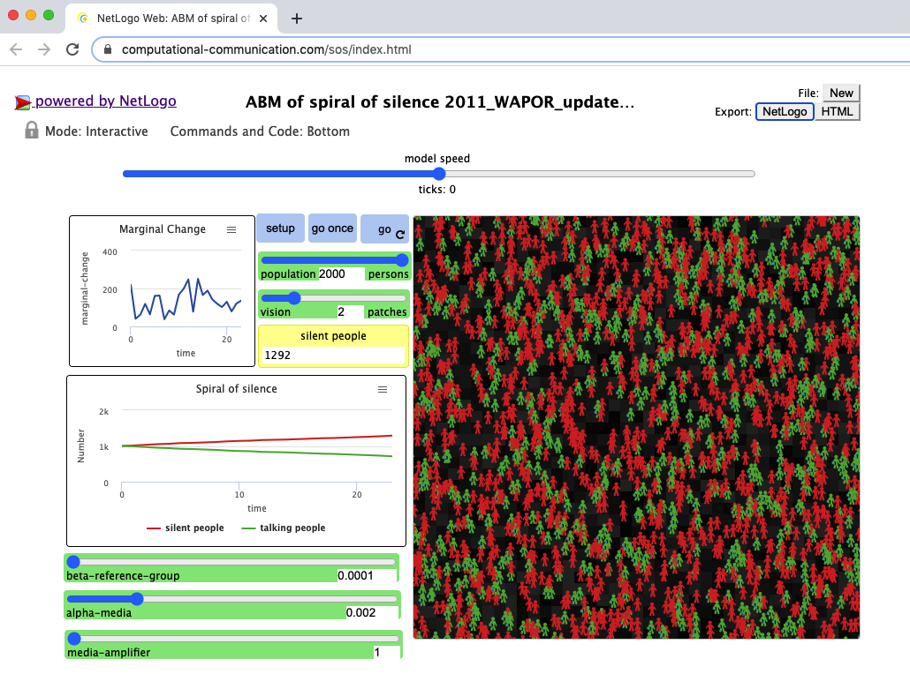

王成军，党明辉，杜骏飞 (2019) [找回失落的参考群体:对沉默的螺旋理论的边界条件的考察](https://mall.cnki.net/magazine/Article/XWDX201904005.htm). 新闻大学. 156:13-29. （入选人大复印资料新闻与传播2019年第8期）

[https://socrateslab.github.io/sos/index.html](https://socrateslab.github.io/sos/index.html)

## 多主体模型代码

1. 读者可以直接打开以上链接运行Netlogo Web版本的代码。
2. 也可以下载本代码仓库中的`ABM of spiral of silence 2011_WAPOR_updated2020.nlogo`文件到本地电脑，安装Netlogo软件后运行。

> 纽曼关于沉默的螺旋的研究来自德国1965年选举迷局。这场选举的竞争主要在基督教民主联盟和基督教社会联盟、社会民主党之间展开。两党从1964年12月到1965年8月的公众选举意愿势均力敌，相差不大；但预测基督教民主联盟和基督教社会联盟胜出的比例不断攀升。对于选举的预测导致最后的选举阶段出现了最后一分钟的动摇：选民在选举接近尾声的时候开始随大流，基督教民主联盟和基督教社会联盟和社会民主党之间的差距被拉大。最终，基督教民主联盟和基督教社会联盟赢得选举。类似的结果在1972年的选举当中再次出现，唯一不同的是这一次赢得大选的政党是社会民主党。纽曼发现人类具有感知意见气候的能力，她将这种能力称之为准统计官能；选举意愿作为一种意见，其随时间的波动幅度远小于感知到的意见气候。**因此，她主张测量感知意见气候（比如“大部分人赞成某件事”）而非意见本身（比如“我赞成某件事”）**。纽曼发现意见的实际变化情况能在对意见气候的感知中得到可靠的反映。“坐火车测试”进一步显示有获胜保障者愿意表达，而可能失败者趋于沉默。

## 数据分析代码

此处的数据收集策略类似于实验研究方法。
- 基于不同的参数将实验分为实验组和对照组，
- 然后让两组模型运行足够多的次数，并记录下来发言者和沉默者人数随时间变化的数据。
- 接下来，需要对通过多主体模型仿真得到的数据进行分析。

本部分的数据分析主要使用R语言进行，详见``SOS Behavior Space.R``

## 勘误：更新代码将媒介影响看成是-5到0的一个均匀分布

https://github.com/socrateslab/sos/issues/2
